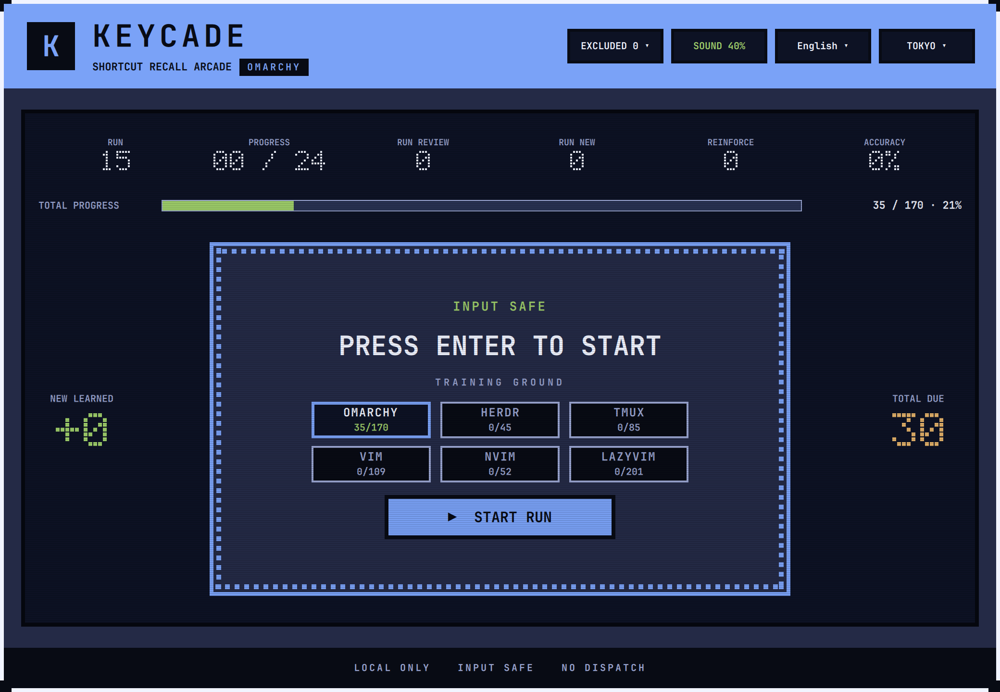
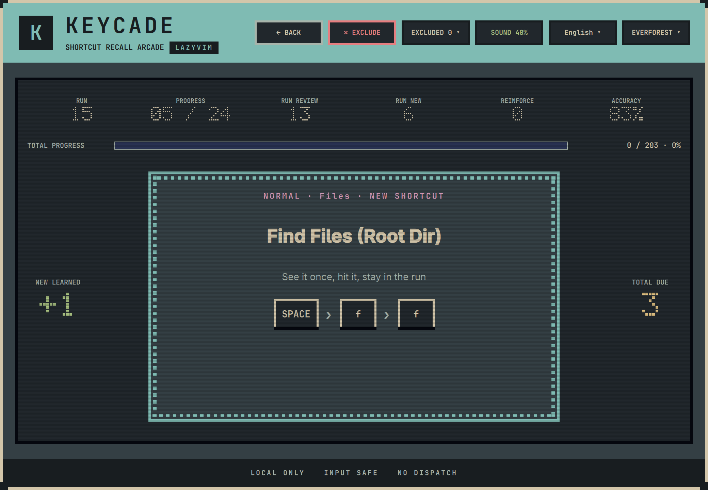

# Keycade

**English** | [简体中文](README.zh-CN.md)

[](https://github.com/luneth90/keycade/actions/workflows/ci.yml)
[](https://plugins.omarchy.org/plugin.html?id=luneth90.keycade)
[](docs/review-invariants.md)
[](manifest.json)
[](LICENSE)

> A shortcut recall arcade for Omarchy, herdr, tmux, Vim, Neovim, and LazyVim






Keycade is a native Omarchy desktop overlay that turns shortcut memorization into quick, arcade-style training runs. Keypresses are captured and judged locally through a Wayland inhibitor, never triggering desktop actions during a session.

Six dedicated training grounds can be selected directly from the home screen, just like machines in an arcade. Each cabinet maintains its own card deck, learning curve, and mastery status:

| Ground | Source of Shortcuts |
| --- | --- |
| **Omarchy** | Active desktop shortcuts read directly from the running compositor |
| **herdr** | Active multiplexer bindings obtained from Omarchy's read-only listing |
| **tmux** | Live server prefixes and key table; falls back to static config and standard table if offline |
| **VIM** | Operators, motions, text objects, and compositions, verified against Neovim documentation |
| **NEOVIM** | Built-in default keybindings collected from a clean Neovim instance |
| **LazyVim** | Official keymaps calibrated automatically to your leader key, enabled extras, and overrides |

Omarchy is selected by default on a fresh install or update; all other grounds are just one click away.

## Core Features

- **Machine-Aware & Reference Tables**: The first three grounds inspect your active system and live server state; the other three draw from upstream-verified reference tables.
- **Multi-Key Sequences**: Supports complex sequences (`<leader>ff`, `gcc`, `C-b %`) as seamlessly as single chords, providing step-by-step visual feedback as you type.
- **Input Isolation**: Hardware keypresses are captured directly by the Wayland inhibitor; no desktop window or application responds while you train.
- **Spaced Repetition Engine**: Each 24-card session balances unlearned, due, weak, and mastered items to build reliable muscle memory.
- **Strict Mastery Standard**: A card is marked as mastered only after two consecutive first-try successes across separate runs.
- **Active Error Correction**: Missed cards display the correct answer for immediate follow-up practice and reappear later in the run.
- **Seamless State Persistence**: Progress is saved locally in real time; interrupted sessions resume seamlessly, and completing a ground triggers a milestone celebration.
- **Deck Customization**: Exclude awkward or unpressable shortcuts at any time; return them whenever you want without losing learning history.
- **Zero-Config Calibration**: Automatically detects your custom Neovim leader keys and tmux prefixes without redundant manual setup.
- **Themes & Localization**: English and Simplified Chinese support, retro sound effects, and five curated palettes: Catppuccin, Tokyo Night, Gruvbox, Everforest, and Ristretto.
- **Retro Arcade Aesthetic**: CRT scanlines, dot-matrix counters, and marquee borders (animations gracefully disable under Reduced Motion while preserving data displays).

To ensure universal playability across compact (60%/65%) keyboards, bindings requiring keys like the function row, dedicated media keys, Print/Pause/SysRq, or separate navigation clusters (Home/End/Insert/Page/Delete) are omitted by default. Standalone `Esc` is reserved for instant saving and quitting (chords like `Super + Esc` remain fully trainable).

## Requirements

- Omarchy 4.x
- Quickshell 0.3.1 (with `Quickshell.Wayland._ShortcutsInhibitor.ShortcutInhibitor`)
- Hyprland (configured with `binds:disable_keybind_grabbing = false`)
- Python 3

Keycade requires active input inhibition to run safely. If Wayland shortcut protection cannot be verified, it refuses to launch rather than falling back to an insecure focus-only mode.

## Keyboard Layouts

Keycade evaluates **physical keypresses**, matching Hyprland's internal shortcut dispatch logic: a binding matches the physical key that generates its base keysym when unshifted, regardless of what character is produced when Shift is held. This is essential for non-US layouts—for example, in a German layout, `SUPER + SHIFT + comma` refers to the physical key labeled `,`, even though pressing Shift generates `;`.

Active keymaps are retrieved directly from Hyprland's `input:kb_*` parameters; shortcuts impossible to type on the current layout are automatically excluded. Character comparison fallback only occurs under custom layouts via `input:kb_file` or user directories (`~/.xkb`, `~/.config/xkb`), where Keycade degrades safely rather than guessing.

## Installation

```bash
omarchy plugin add https://github.com/luneth90/keycade.git --enable
```

Bind a shortcut in `~/.config/hypr/bindings.lua`, for example:

```bash
echo 'o.bind("SUPER + SHIFT + K", "Keycade", "omarchy-shell shell summon luneth90.keycade '\''{}'\''")' >> ~/.config/hypr/bindings.lua
```

## Updating

```bash
omarchy plugin update luneth90.keycade
omarchy restart shell
```

> **Note**: Restarting the shell is required to ensure running Quickshell components reload the updated code.

## Usage

- **Launch**: Press `Super + Shift + K`, or run:
  ```bash
  omarchy-shell shell summon luneth90.keycade '{}'
  ```
- **Select Cabinet**: Use the home screen to pick a training ground, then press Enter to begin or resume. Each cabinet displays current completion percentage (or "—" if unplayed).
- **Switching Grounds**: Click `BACK` at any time; your progress is automatically saved, and returning to that ground restores your exact position.
- **Preferences**: Use the top bar to toggle language, sound effects, volume, and color themes. Preferences are saved automatically.
- **Excluding Shortcuts**: Click `✕ EXCLUDE` during a card to remove it from active runs and mastery counts. Re-enable excluded items anytime via the `EXCLUDED` panel without losing past accuracy stats.
- **Exiting**: Release a bare `Esc` key to save and exit immediately. Chords involving Esc (`Super + Esc`, etc.) are treated as ordinary answers.

User statistics and session data are stored under `${XDG_STATE_HOME:-$HOME/.local/state}/omarchy/keycade/` and persist across updates.

## Uninstallation

```bash
omarchy plugin remove luneth90.keycade
```

Saved data remains preserved in `${XDG_STATE_HOME:-$HOME/.local/state}/omarchy/keycade/`. Keycade intentionally does not ship destructive scripts that alter Hyprland configurations or erase user progress on uninstall.

## Development & Testing

### Host System Inspection

Upstream defaults form the core table; user configuration files are inspected solely to calibrate leader and prefix keys. Files are parsed via descriptor-relative sandboxed reads adhering strictly to fixed paths and formats. Untrusted or complex constructs are safely skipped, recorded, and defaulted to upstream standards. No arbitrary Lua code is executed, no editors are spawned, and no `require` chains are followed.

tmux is the only service queried dynamically: once `has-session` confirms an active server, `show-options` retrieves `prefix` and `prefix2`, and `list-keys` fetches live bindings. When no server is running, Keycade parses global `set` directives in `~/.config/tmux/tmux.conf` and `~/.tmux.conf` while preserving default bindings. Both prefixes are accepted; if `C-b` is present, it is favored on the prompt card.

### Tests & Screenshots

```bash
python3 -m unittest discover -s tests -p 'test_*.py' -v
QT_QPA_PLATFORM=offscreen QT_QPA_PLATFORMTHEME= QT_STYLE_OVERRIDE=Fusion \
  /usr/lib/qt6/bin/qmltestrunner -input tests/qml/tst_algorithms.qml -import /usr/lib/qt6/qml
./tests/test_state_store_qml.sh
./tests/test_hyprland_source_qml.sh
./tests/test_ground_switching_qml.sh
./tests/test_run_counters_qml.sh
/usr/lib/qt6/bin/qmllint -I /usr/lib/qt6/qml Keycade.qml lib/*.qml lib/sources/*.qml dev/InputProbe.qml
./tools/shoot-screenshots
```

## License

Keycade is released under the [MIT License](LICENSE). Copyright © 2026 luneth90.
