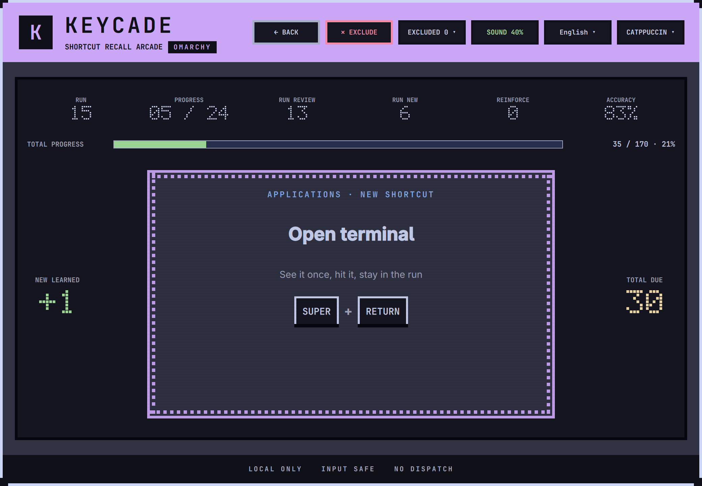
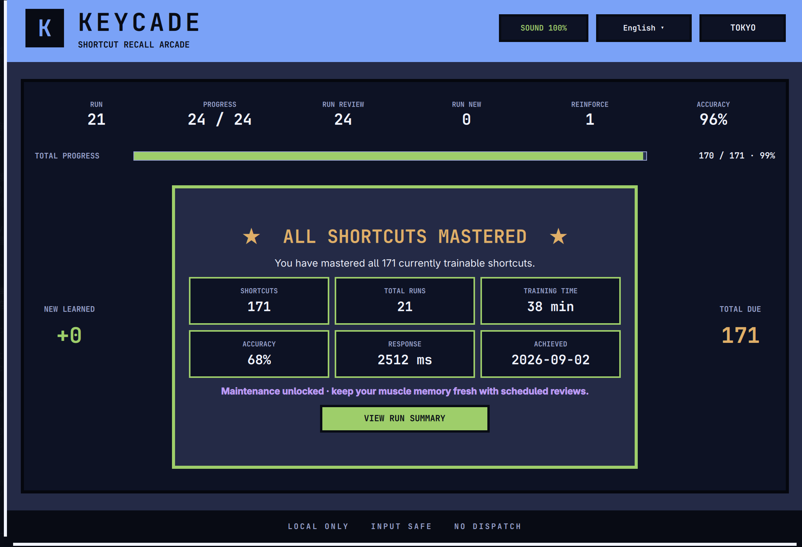

# Keycade

**English** | [简体中文](README.zh-CN.md)

> Shortcut Recall Arcade





Keycade is a native Omarchy shortcut trainer. It turns shortcuts into short,
adaptive recall runs. Correct input is recognized locally and never dispatches
the original shortcut action.

It trains six **training grounds**, picked on the home screen like a cabinet
in an arcade. Each keeps its own deck, its own progress and its own mastery,
and the row shows where every one of them stands:

| Ground | Where its shortcuts come from |
| --- | --- |
| **Hyprland** | The shortcuts active on your machine, read from the running compositor |
| **herdr** | The bindings active on your machine, through Omarchy's read-only listing |
| **tmux** | The running server's real prefixes and documented table; a stopped server uses literal local prefix settings plus the shipped table |
| **VIM** | Operators, motions, text objects and compositions cited against Neovim's runtime help |
| **NEOVIM** | Neovim's built-in mappings collected from a clean instance |
| **LazyVim** | LazyVim's published keymaps, calibrated by your leader, extras and literal top-level overrides |

Hyprland is what you get on a fresh install and after an upgrade; the other
grounds are there when you want them.

## Core features

- Trains your active Hyprland shortcuts instead of a fixed generic list.
- Also trains application shortcuts that come in sequences - `<leader>ff`,
  `gcc`, `C-b %` - showing each step and lighting it as you type it.
- Uses a protected full-screen overlay with Exclusive focus and Wayland
  Shortcuts Inhibitor, so training input does not trigger desktop actions.
- Builds one continuous 24-card run from new, due, weak, and mastered
  shortcuts without artificial waves.
- Guarantees coverage over continued play and schedules spaced reviews.
- Marks a shortcut mastered after two consecutive first-try successes across
  at least two different runs.
- Keeps the correct answer visible after a mistake, requires a correction, and
  reviews the shortcut again later in the run.
- Saves progress locally, resumes interrupted runs, tracks total mastery, and
  shows a one-time celebration when every eligible shortcut first reaches 100%.
- Lets you exclude a shortcut your keyboard cannot press, or one you do not
  want to train, and restore it later with its progress intact.
- Resolves a ground's configurable keys - LazyVim's leader, tmux's prefix -
  from the real local configuration, so nobody maintains a second, manual
  copy of them. What was resolved shows up on the cards, not as one more
  panel in the top bar.
- Includes English and Simplified Chinese, local feedback/countdown sounds,
  and five palettes: Catppuccin, Tokyo Night, Gruvbox, Everforest and
  Ristretto.
- Reads like a cabinet: dot matrix countdown and counters, scanlines on the
  screen, a marquee frame, and a streak counter that is display only and never
  reaches the scheduler. Reduced motion turns the movement off and keeps every
  reading.

Function-row, XF86 media/device, Print/Pause/SysRq, dedicated
Home/End/Insert/Page/Delete, ambiguous, unsafe, and unsupported bindings are
excluded: a compact keyboard is not guaranteed to carry them. A shortcut whose
answer is a bare Esc is excluded too - releasing Esc saves the run and leaves,
so that card could never be cleared. Esc held with a modifier is a different
gesture, decided on release, and stays trainable.

## Requirements

- Omarchy 4.x
- Quickshell 0.3.1 with
  `Quickshell.Wayland._ShortcutsInhibitor.ShortcutInhibitor`
- Hyprland with `binds:disable_keybind_grabbing = false`
- Python 3

Keycade refuses to start a run when it cannot verify input protection. It does
not fall back to an unsafe focus-only mode.

## Keyboard layouts

Keycade judges an answer by which physical key was pressed, the same way
Hyprland decides whether a bind fires: a bind names the key that produces its
keysym with no modifiers held, whatever that key types once Shift is down. This
matters on non-US layouts, where `SUPER + SHIFT + comma` is the key labelled `,`
even though it types `;` while Shift is held.

Keycade reads the layout from Hyprland's own `input:kb_*` options. A bind whose
key has no unshifted position on the active layout cannot be pressed at all, so
it is left out of training rather than taught.

Two setups fall back to comparing typed characters, which is how earlier
versions always worked: a keymap supplied through `input:kb_file`, and a custom
layout under `~/.xkb` or `~/.config/xkb`. Keycade does not read files outside
Hyprland's own output, so it steps back rather than guess.

## Install

```bash
omarchy plugin add https://github.com/luneth90/keycade.git --enable
```

This is Omarchy's standard plugin installation path. Then add a shortcut to
`~/.config/hypr/bindings.lua`, for example:

```bash
echo 'o.bind("SUPER + SHIFT + K", "Keycade", "omarchy-shell shell summon luneth90.keycade '\''{}'\''")' >> ~/.config/hypr/bindings.lua
```

## Update

```bash
omarchy plugin update luneth90.keycade
omarchy restart shell
```

The restart is required — updating alone does not reliably reload Keycade.

## Use

- Launch with `Super + Shift + K`, or run
  `omarchy-shell shell summon luneth90.keycade '{}'`.
- Pick a training ground on the home screen - Hyprland, herdr, tmux, VIM,
  NEOVIM or LazyVim - then press Enter. Every cabinet shows where it stands,
  not only the one you are on, so the row reads as a single picture of your
  progress; a ground you have never opened shows a dash rather than a zero.
- A run belongs to the ground it was dealt from, and so do its numbers. To
  train somewhere else, press BACK: the run is saved exactly as leaving the
  overlay saves it, and picking that cabinet again resumes where it stopped.
- Press Enter to start or continue a run.
- Release Esc to save the current run and exit safely. This only fires for a
  bare Esc; Esc held with a modifier (e.g. `Super + Esc`) is treated as a
  normal shortcut chord, so it won't fight with a system binding that also
  uses Esc (like a Super + Esc menu) while you're answering a card for it.
- Use the top menus to switch language, sound, volume, and palette. Five
  palettes are included and the choice is remembered between runs.
- Press `✕ EXCLUDE` in the top bar for a shortcut your keyboard cannot produce,
  or one you simply do not want to train. It leaves training for good and stops
  counting toward mastery, so a key your board does not have can no longer hold
  a run — or 100% — hostage.
- Open `EXCLUDED` in the top bar to see what you have set aside and put any of
  it back. A restored shortcut returns with its history, so nothing you learned
  is lost by excluding it. The list is capped, and the last remaining shortcut
  cannot be excluded.

Progress is stored under
`${XDG_STATE_HOME:-$HOME/.local/state}/omarchy/keycade/` and is preserved across
updates.

## Uninstall

Remove the plugin while preserving progress:

```bash
omarchy plugin remove luneth90.keycade
```

Progress remains in `${XDG_STATE_HOME:-$HOME/.local/state}/omarchy/keycade/`.
Keycade intentionally does not provide a script that deletes user state or
edits Hyprland configuration during removal.

## Development

### What the application grounds read from your machine

The tables are the upstream defaults. Keycade does not ask you to maintain a
second, manual choice for a configurable leader or prefix. It resolves those
keys from the small, fixed-shape part of the real local configuration and falls
back to the upstream default only when no value can be proved. Those keys are
applied to the deck.

The LazyVim reader accepts common equivalent literal forms: dot or bracket
`vim.g` assignments, exact `nvim_set_var` / `vim.cmd("let …")` forms and
literal `vim.keycode` wrappers. In `lua/config/keymaps.lua` it accepts direct
`vim.keymap.set/del`, the legacy global API, balanced multiline calls, literal
mode arrays and option tables, and statically allowlisted local aliases.
Dynamic values, block-local calls, unknown wrappers and `require` chains are
skipped and counted. No Lua runs and no editor starts.

tmux is the one live query. After `has-session` proves a server already exists,
Keycade reads its effective `prefix` and `prefix2` with `show-options`, then its
documented bindings with `list-keys`. With no server, it only parses literal
global `set` / `set-option` forms in the fixed XDG and `~/.tmux.conf` paths and
keeps the shipped binding table. tmux fires on either prefix, so both are
accepted: `C-b` is the one shown on the card whenever it is genuinely enabled,
and the other stays a valid alternate. A machine that sets a different prefix
alone is taken at its word. A prefix that cannot be proved falls back to tmux's
own `C-b` default.

### Application shortcut packs

The LazyVim, tmux, VIM and NEOVIM fallback tables are static data collected on
a maintainer's machine and committed as reviewable JSON. Pack generation never
runs on a user's machine and never fetches anything at runtime; the bounded
local calibration described above is separate from that build pipeline.

When an upstream moves, re-collect and read the JSON diff:

```bash
git clone https://github.com/LazyVim/LazyVim.github.io ../LazyVim.github.io
git clone https://github.com/LazyVim/LazyVim ../LazyVim && git -C ../LazyVim checkout v16.0.0
python3 tools/build_packs.py --collect lazyvim --site ../LazyVim.github.io --lazyvim ../LazyVim

printf '# tmux %s\n' "$(tmux -V | awk '{print $2}')" > /tmp/tmux-keys.txt
tmux -L keycade-build -f /dev/null list-keys -N -T prefix >> /tmp/tmux-keys.txt
tmux -L keycade-build kill-server
python3 tools/build_packs.py --collect tmux --listing /tmp/tmux-keys.txt

python3 tools/build_packs.py --collect vim --runtime /usr/share/nvim/runtime \
  --runtime-version 'NVIM v0.12.5'
```

The `-f /dev/null` is not optional: without it tmux starts a server, sources
your own `tmux.conf`, and collects your keys instead of the defaults.

```bash
python3 -m unittest discover -s tests -p 'test_*.py' -v
QT_QPA_PLATFORM=offscreen QT_QPA_PLATFORMTHEME= QT_STYLE_OVERRIDE=Fusion \
  /usr/lib/qt6/bin/qmltestrunner -input tests/qml/tst_algorithms.qml -import /usr/lib/qt6/qml
./tests/test_state_store_qml.sh
./tests/test_hyprland_source_qml.sh
./tests/test_ground_switching_qml.sh
./tests/test_run_counters_qml.sh
/usr/lib/qt6/bin/qmllint -I /usr/lib/qt6/qml Keycade.qml lib/*.qml lib/sources/*.qml dev/InputProbe.qml
```

## License

Keycade is released under the [MIT License](LICENSE). Copyright © 2026 luneth90.
