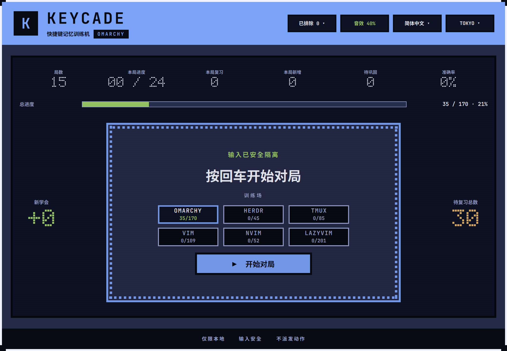
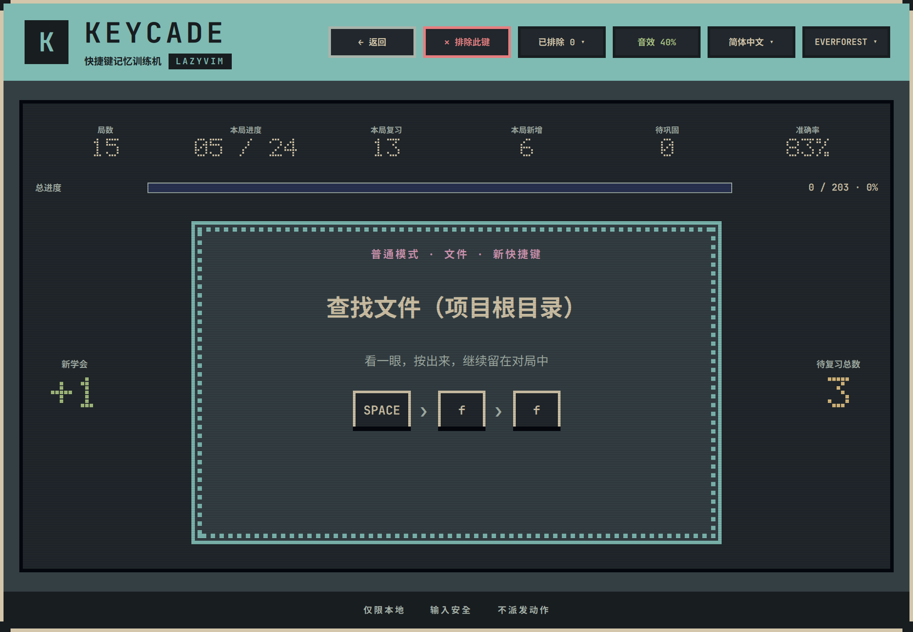

# Keycade

[English](README.md) | **简体中文**

[](https://github.com/luneth90/keycade/actions/workflows/ci.yml)
[](https://plugins.omarchy.org/plugin.html?id=luneth90.keycade)
[](docs/review-invariants.md)
[](manifest.json)
[](LICENSE)

> 专为 Omarchy、herdr、tmux、Vim、Neovim 与 LazyVim 打造的快捷键记忆街机






Keycade 是 Omarchy 的原生桌面覆盖层（Overlay），将快捷键记忆转化为节奏明快、街机风格的闯关练习。所有按键输入均在本地拦截判定，训练时不会误触发系统或应用的原本动作。

主界面提供 6 个独立的快捷键机台（训练场），就像置身街机厅选机台一样直观。每个机台拥有完全独立的卡牌题库、学习曲线与掌握度评估：

| 训练场 | 快捷键来源 |
| --- | --- |
| **Omarchy** | 直接读取当前运行中合成器里本机实际生效的桌面快捷键 |
| **herdr** | 基于 Omarchy 的只读清单，读取本机实际生效的终端复用器快捷键 |
| **tmux** | 实时读取正在运行的 tmux 服务前缀与按键表；服务未启动时读取本地配置搭配标准表 |
| **VIM** | 包含操作符、光标移动、文本对象及组合操作，均严格对照 Neovim 官方文档校验 |
| **NEOVIM** | 采集自全新纯净 Neovim 实例的内置默认按键映射 |
| **LazyVim** | 基于官方键位表，自动结合你的 leader 键、开启的 extras 模块及自定义映射完成校准 |

初次安装或版本升级后默认选择 Omarchy 机台，点击即可随时切换到其他机台。

## 核心功能

- **实机读取与权威题库**：前 3 个训练场直接读取本机当前的实时配置与服务状态，所练即所用；后 3 个训练场严格基于官方规范发布的权威键位表。
- **序列连打即时判定**：不仅支持常规组合键，还原生支持 `<leader>ff`、`gcc`、`C-b %` 等连续按键；卡片分步显示，按对一步即时点亮一步。
- **全局快捷键安全隔离**：基于 Wayland 快捷键抑制机制（Shortcuts Inhibitor），练习期间完全接管输入，彻底避免误触桌面动作。
- **科学的间隔重复算法**：每轮 24 张卡片，均衡编排未学、到期复习、易错薄弱与已掌握快捷键，稳步建立持久的肌肉记忆。
- **严谨的掌握度判定**：必须在连续两次不同的对局中均首试正确，卡片才会被判定为“已掌握”。
- **错题即时跟练纠错**：答错时界面保留正确答案引导跟练一次，并在当前轮次后段自动重新出题强化。
- **进度实时保存与断点续练**：学习进度实时保存在本地，随时退出随时恢复进度；机台达成 100% 掌握时触发里程碑庆祝。
- **个性化卡牌排除**：对于键盘按不出或暂时不想练习的键位，可随时一键排除；亦可在排除面板中随时恢复，历史练习数据完整保留。
- **零配置智能校准**：自动读取 Neovim leader 键与 tmux prefix 前缀，无需额外手动配置。
- **多语言与复古主题**：原生支持中英双语、复古电子音效，内置 Catppuccin、Tokyo Night、Gruvbox、Everforest 与 Ristretto 五套精致配色。
- **复古街机视觉质感**：细腻的 CRT 扫描线、点阵字符与动感跑马灯；开启系统“减少动效”时自动平滑关闭动画，读数依然清晰呈现。

为保证紧凑配列（60%/65% 等）键盘的良好体验，题库默认排除了可能缺失的物理键（F 区功能键、独立方向/导航键区、PrintScreen 等）以及存在歧义或无法可靠读取的绑定。此外，单独按下 `Esc` 用于即时存盘退出，因此单按 Esc 不作为题目出题（带有修饰键的如 `Super + Esc` 仍可正常出题）。

## 系统要求

- Omarchy 4.x
- Quickshell 0.3.1（须包含 `Quickshell.Wayland._ShortcutsInhibitor.ShortcutInhibitor`）
- Hyprland（须配置 `binds:disable_keybind_grabbing = false`）
- Python 3

Keycade 启动前必须确认 Wayland 快捷键抑制（输入保护）已完全激活；若保护不可用，程序将安全拒绝启动，绝不降级至仅依赖窗口焦点的不可靠模式。

## 键盘布局与物理键判定

Keycade 依据**按下的物理键位**进行判定，与 Hyprland 的底层触发逻辑完全保持一致：快捷键所声明的是“未按下修饰键时该键所对应的 keysym”，而与按住 Shift 后实际打出的字符无关。这在非美式键盘（如德语、法语等）上尤为重要——例如德式键盘中，`SUPER + SHIFT + comma` 指代的是键帽印刷为 `,` 的那个物理键，即使按住 Shift 时它实际输入的是 `;`。

布局信息直接源自 Hyprland 的 `input:kb_*` 参数；当前布局在物理上无法按出的绑定会自动剔除。仅在通过 `input:kb_file` 指定映射或使用用户目录（`~/.xkb`、`~/.config/xkb`）自定义布局时，才会退化为字符匹配模式；Keycade 严格限制只读 Hyprland 自身输出，宁可安全降级也绝不盲目猜测。

## 安装指南

```bash
omarchy plugin add https://github.com/luneth90/keycade.git --enable
```

在 `~/.config/hypr/bindings.lua` 中添加唤起快捷键，例如：

```bash
echo 'o.bind("SUPER + SHIFT + K", "Keycade", "omarchy-shell shell summon luneth90.keycade '\''{}'\''")' >> ~/.config/hypr/bindings.lua
```

## 更新指南

```bash
omarchy plugin update luneth90.keycade
omarchy restart shell
```

> **注意**：更新后必须重启 shell，确保常驻的 Quickshell 进程彻底重新加载最新代码。

## 使用说明

- **启动**：按下快捷键 `Super + Shift + K`，或在终端执行：
  ```bash
  omarchy-shell shell summon luneth90.keycade '{}'
  ```
- **选择机台**：在首页浏览机台，按回车键开始或继续练习。每个机台卡片上直观显示当前掌握百分比（未开始练习的显示“—”）。
- **切换机台**：随时点击「← 返回」按钮退出当前练习，进度将自动保存，下次进入可无缝断点续练。
- **个性化设置**：在顶部控制栏切换语言、声音开关、音量与色彩主题，选项将自动记忆。
- **排除特定快捷键**：遇到当前键盘无法按出或暂不想练的快捷键，点击卡片右上方的 `✕ 排除此键` 即可移出题库且不计入掌握度；点击顶栏「已排除」可随时查看并移回题库，历史数据完好保留。
- **退出保存**：单按并松开 `Esc` 键即可安全存盘并关闭覆盖层。带有修饰键的 Esc 组合键（如 `Super + Esc`）作为常规快捷键处理，不触发退出。

用户进度与配置持久化保存在 `${XDG_STATE_HOME:-$HOME/.local/state}/omarchy/keycade/` 目录下，更新插件不会丢失数据。

## 卸载

```bash
omarchy plugin remove luneth90.keycade
```

卸载后用户数据仍安全保留在 `${XDG_STATE_HOME:-$HOME/.local/state}/omarchy/keycade/`。Keycade 绝不在卸载时附带删除用户数据或静默修改 Hyprland 配置的危险脚本。

## 开发与测试说明

### 本机配置读取策略

内置词条库采用官方默认标准；读取本机配置仅用于校准 leader 键与 prefix 前缀。所有读取均采用基于文件描述符的沙盒相对路径，严格限定固定路径与预期格式；遇到不可信或复杂写法时安全跳过并计数，回退至官方默认。绝不执行外部 Lua 脚本、不拉起外部编辑器，亦不递归追踪 `require` 依赖链。

tmux 是唯一的运行时动态查询：在通过 `has-session` 校验服务存活后，依次通过 `show-options` 读取实际生效的 `prefix` / `prefix2` 并用 `list-keys` 读取键位。若无正在运行的 server，则仅安全解析 `~/.config/tmux/tmux.conf` 与 `~/.tmux.conf` 中的全局 `set` 选项，键位沿用内置标准表。两个前缀均可触发，若包含默认前缀 `C-b` 则优先展示在题目卡上。

### 自动化测试与截图

```bash
python3 -m unittest discover -s tests -p 'test_*.py' -v
QT_QPA_PLATFORM=offscreen QT_QPA_PLATFORMTHEME= QT_STYLE_OVERRIDE=Fusion \
  /usr/lib/qt6/bin/qmltestrunner -input tests/qml/tst_algorithms.qml -import /usr/lib/qt6/qml
./tests/test_state_store_qml.sh
./tests/test_hyprland_source_qml.sh
./tests/test_ground_switching_qml.sh
./tests/test_run_counters_qml.sh
/usr/lib/qt6/bin/qmllint -I /usr/lib/qt6/qml Keycade.qml lib/*.qml lib/sources/*.qml dev/InputProbe.qml
./tools/shoot-screenshots
```

## 开源协议

Keycade 采用 [MIT 许可证](LICENSE) 发布。Copyright © 2026 luneth90。
