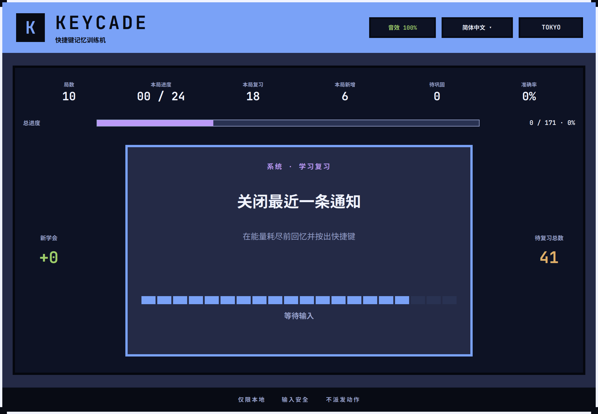
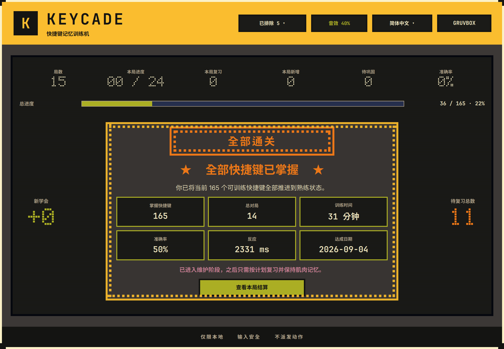

# Keycade

[English](README.md) | **简体中文**

> 快捷键记忆训练机





Keycade 是一个面向 Hyprland 的原生 Omarchy 快捷键训练器。它读取当前电脑上
真正生效的快捷键，并将它们编成简短的自适应回忆练习。正确输入只在本地识别，
不会派发或执行原快捷键动作。

## 核心功能

- 训练当前 Hyprland 会话中的真实快捷键，而不是固定的通用题库。
- 使用 Exclusive 焦点与 Wayland Shortcuts Inhibitor 保护全屏练习输入，避免
  触发桌面动作。
- 将未学、到期、薄弱和已掌握快捷键组成一局连续的 24 张卡，不设置人为波次。
- 持续游玩可以覆盖全部未排除快捷键，并按间隔复习计划重新出现。
- 最近 2 次首次作答连续正确且正确记录跨至少 2 个不同对局后，快捷键进入掌握。
- 答错后持续显示正确答案，必须正确跟按，并在本局稍后再次复测。
- 本地保存学习进度、恢复中断对局、显示总掌握进度，并在首次达到 100% 时展示
  一次性恭喜结算。
- 可以排除键盘按不出、或者不想练的快捷键，随时一键恢复，进度不丢。
- 内置英语和简体中文、本地反馈/倒计时音效，以及 Tokyo Night、Gruvbox
  两套配色。

F 功能键、XF86 媒体/设备键、Print/Pause/SysRq、独立的 Home/End/Insert/Page/Delete、
有歧义、危险或无法可靠识别的绑定会被排除——紧凑配列键盘不保证有这些键。

## 系统要求

- Omarchy 4.x
- Quickshell 0.3.1，并包含
  `Quickshell.Wayland._ShortcutsInhibitor.ShortcutInhibitor`
- Hyprland，且 `binds:disable_keybind_grabbing = false`
- Python 3

如果无法确认输入保护已经激活，Keycade 会拒绝开始练习，不会退化为不安全的
仅焦点保护模式。

## 键盘布局

Keycade 按**按下的物理键**判定，与 Hyprland 决定快捷键是否触发的方式一致：
一条绑定指的是「不按修饰键时产生该 keysym 的那个键」，与按住 Shift 后它打出
什么字符无关。这在非 US 布局上很关键——德语下 `SUPER + SHIFT + comma` 指的
是键帽上写着 `,` 的那个键，尽管按住 Shift 时它打出的是 `;`。

布局取自 Hyprland 自己的 `input:kb_*` 配置。如果一条绑定的按键在当前布局上
没有对应的物理键，它本来就按不出来，Keycade 不会拿它出题。

有两种配置会退回按字符比较，也就是旧版本一直以来的方式：通过
`input:kb_file` 指定的键盘映射文件，以及 `~/.xkb` 或 `~/.config/xkb` 下的自定义
布局。Keycade 不读取 Hyprland 输出以外的文件，因此选择退让而不是猜测。

## 安装

```bash
omarchy plugin add https://github.com/luneth90/keycade.git --enable
```

这是 Omarchy 的标准插件安装路径。然后向 `~/.config/hypr/bindings.lua`
添加快捷键，例如：

```bash
echo 'o.bind("SUPER + SHIFT + K", "Keycade", "omarchy-shell shell summon luneth90.keycade '\''{}'\''")' >> ~/.config/hypr/bindings.lua
```

## 更新

```bash
omarchy plugin update luneth90.keycade
omarchy restart shell
```

重启这一步必须做——只更新不重启，Keycade 不一定会刷新。

## 使用

- 按 `Super + Shift + K` 启动，或执行
  `omarchy-shell shell summon luneth90.keycade '{}'`。
- 按 Enter 开始或继续对局。
- 释放 Esc 保存当前对局并安全退出。这个操作只在单独按 Esc（不带任何修饰键）时触发；
  带修饰键的 Esc 组合（例如 `Super + Esc`）会被当作普通快捷键处理，
  不会跟系统里同样用到 Esc 的绑定（比如 Super + Esc 打开系统菜单）冲突，
  练习到这个组合时也能正常答题。
- 使用顶部菜单切换语言、声音、音量和配色。
- 遇到键盘按不出的快捷键，点顶栏的 `✕ 排除此键`：它会永久离开训练题库，不再计入
  掌握进度，并出现在顶栏的「已排除」列表里，点一下即可连同进度一起恢复。

学习进度保存在 `${XDG_STATE_HOME:-$HOME/.local/state}/omarchy/keycade/`，更新插件不会丢失。

## 卸载

卸载插件并保留学习进度：

```bash
omarchy plugin remove luneth90.keycade
```

学习进度仍保存在 `${XDG_STATE_HOME:-$HOME/.local/state}/omarchy/keycade/`。Keycade
有意不提供在卸载时删除用户状态或修改 Hyprland 配置的脚本。

## 开发与测试

```bash
python3 -m unittest discover -s tests -p 'test_*.py' -v
QT_QPA_PLATFORM=offscreen QT_QPA_PLATFORMTHEME= QT_STYLE_OVERRIDE=Fusion \
  /usr/lib/qt6/bin/qmltestrunner -input tests/qml/tst_algorithms.qml -import /usr/lib/qt6/qml
./tests/test_state_store_qml.sh
./tests/test_keybind_source_qml.sh
/usr/lib/qt6/bin/qmllint -I /usr/lib/qt6/qml Keycade.qml lib/*.qml dev/InputProbe.qml
```

## 许可证

Keycade 使用 [MIT License](LICENSE) 发布。Copyright © 2026 luneth90。
